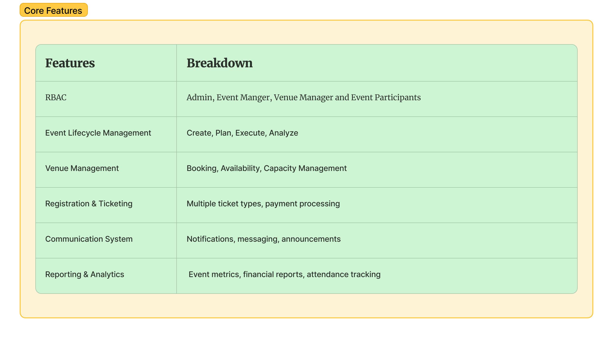
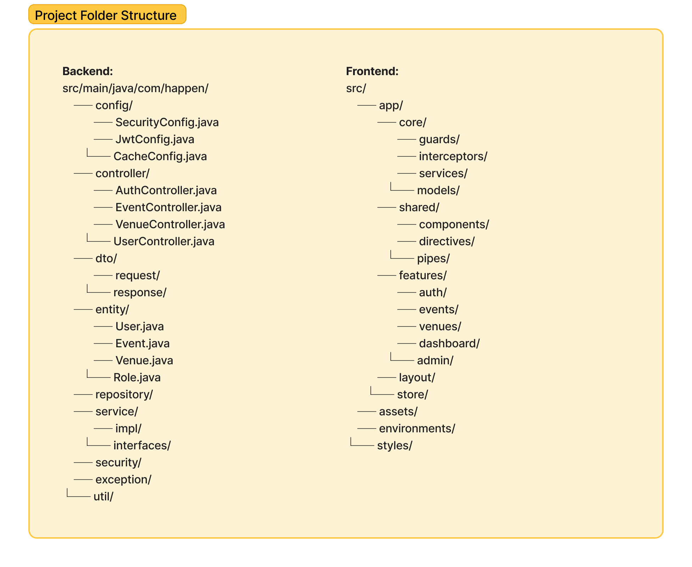
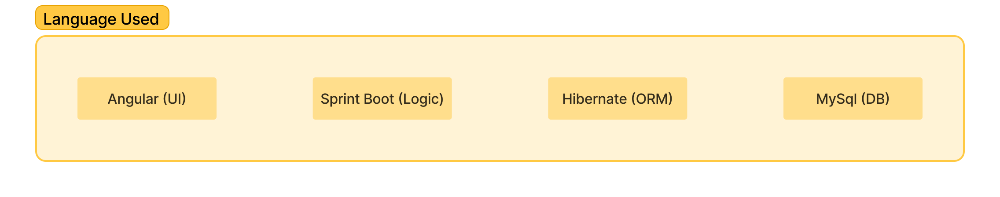
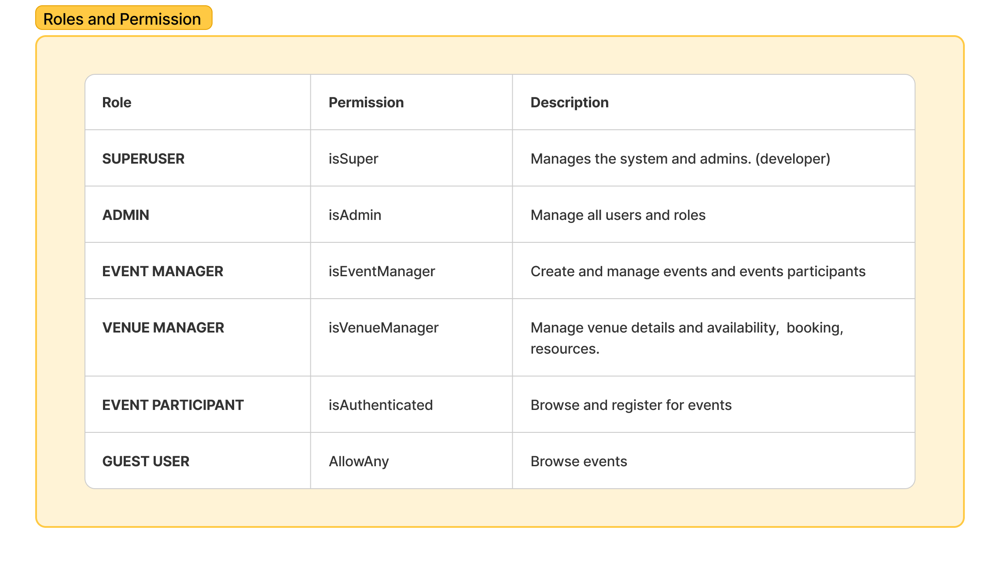
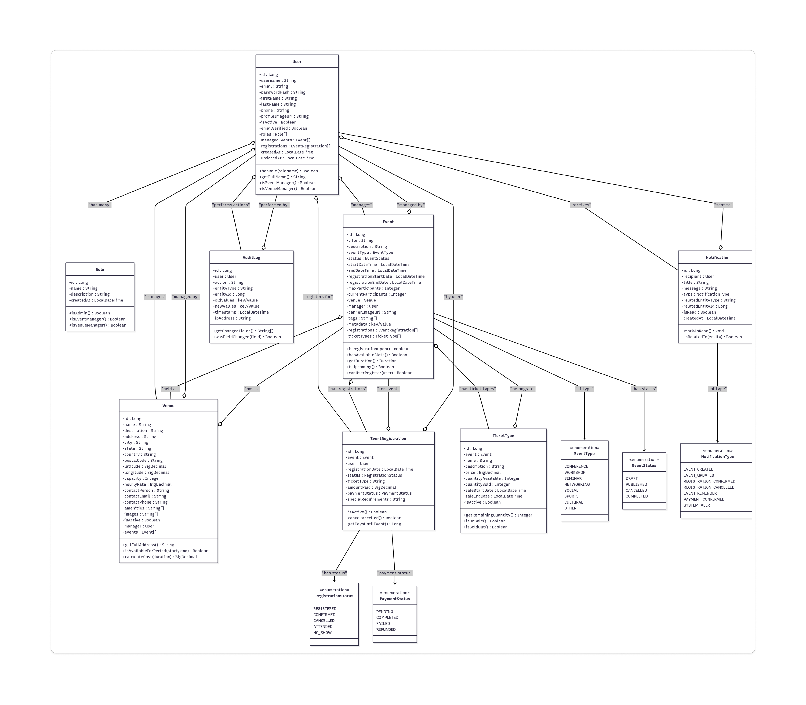
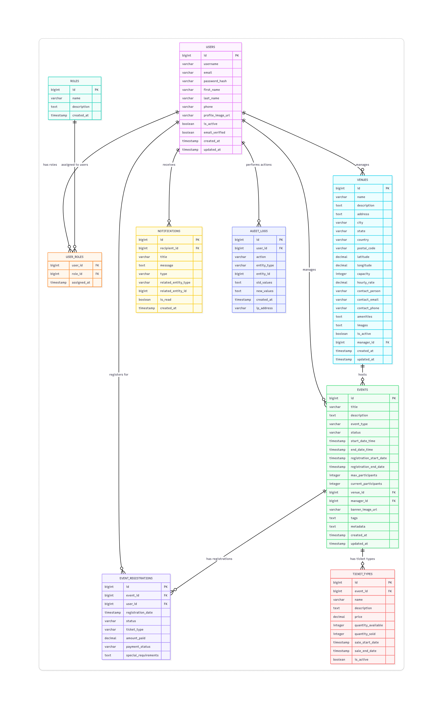
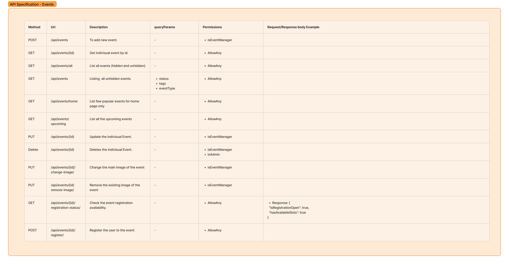
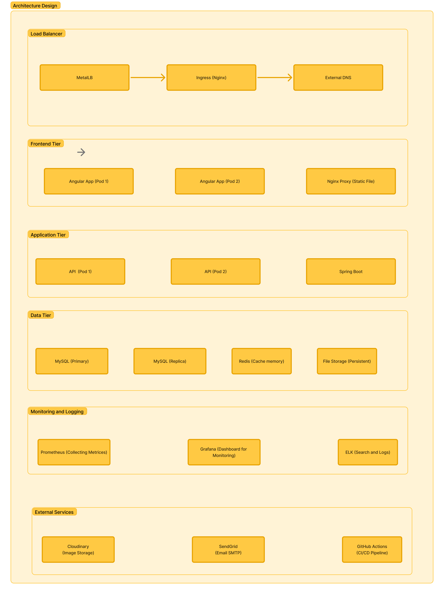

# Happen-backend
## An event management system which solves the problem of searching, managing and listing everything related to events.

### ************************************

## Core Feature

## Folder Structure

## Language Used

## Roles

## Class Diagram

## Service Level Class Diagram

## ER Diagram

## API Specification for Events

## Architecture (Trying to implement this fully but will take time)

## ********
